# RP2350 cryptographic benchmarks — final summary

Arm Cortex-M33 vs RISC-V Hazard3 on one RP2350 (Raspberry Pi Pico 2, board
`E0E14525E64AF6ED`), seven cryptographic libraries, classical and post-quantum,
single- and dual-core, 18–558 MHz at 1.05 V and 1.60 V. Measured 19–24 September 2026.

The illustrated version is `rp2350-crypto-v2.6.7-report.html`. The charts
referenced below are in `svg/`. The raw source data are in `raw/`

---

## 1. Conclusions

1. **At the default 150 MHz, post-quantum cryptography is a tie between the cores.**
   ML-KEM and ML-DSA are within ±4% in cycles. With GCC 14 the M33 led by
   15–23% on ML-DSA; GCC 16.1 closed the gap on Hazard3.
2. **Classical software still favours the M33.** Monocypher 1.5–1.7×, RSA-2048
   1.9–2.2×, micro-ecc 1.7–1.9× and p256-m 2.6×. The last two compare Arm assembly
   with portable C. Mbed TLS ranges from 1.0× to 1.3× depending on the build,
   because its large code footprint is sensitive to flash layout.
3. **Library choice matters more than the core.** On the M33, micro-ecc is the
   fastest P-256 for every operation, with verification 4.1× faster than Mbed TLS.
   Monocypher does X25519 9.5× faster than Mbed TLS. The SHA-256 accelerator is
   9.6× faster than software SHA-256.
4. **Overclocking works to about 550 MHz at 1.60 V, but not reliably.**
   - **Ceilings:** every suite passed 540–558 MHz on both cores except the M33
     post-quantum suites. Those locked up at 400 MHz, which makes 351 MHz the
     highest clock where everything passed on both cores.
   - **Variation:** ceilings moved by up to about 200 MHz between two runs.
5. **Overclocking fails in four ways:**
   - a hang the watchdog recovers;
   - a lockup that needs a manual power cycle (five times on the M33);
   - core 1 stopping while core 0 carries on;
   - once, a **wrong ML-DSA-87 result** on Hazard3 at 546 MHz, with no hang
     and no error code.
6. **The flash divider costs throughput above 200 MHz, mostly for Mbed TLS.**
   Mbed TLS keeps 85–92% of the clock gain and Monocypher on Hazard3 96%.
   Everything else scales within 1% of the clock.
7. **ML-DSA signing time depends on the input by up to 6.6×.** This is rejection
   sampling, so compare signing only on the same key and message.
8. **Both cores are stable at 1.05 V from 18 to 150 MHz**, with every suite passing.

---

## 2. Data used

| Role | Firmware (build) | Core | Toolchain | Source rev | Voltage, clocks |
|---|---|---|---|---|---|
| Overclock sweep, **primary** | crypto_sweep v2.6.7 (2609d70f) | Cortex-M33 | GCC 15.2.1 | 5c3273beb52e | 1.60 V, 150–600 MHz |
| Overclock sweep, **primary** | crypto_sweep v2.6.7 (751d8e6c) | Hazard3 | GCC 16.1.0 | 5c3273beb52e | 1.60 V, 150–570 MHz |
| Overclock sweep, second sample | crypto_sweep v2.6.5 (cc14703a / 8b79c903) | both | GCC 15.2.1 / 16.1.0 | 53567221e344 / ba5102fef17f-dirty | 1.60 V, 150–600 MHz |
| GCC 14 baseline + underclock | crypto_sweep v2.5.1 (2b5edf8a) | Cortex-M33 | GCC 14.2.1 | — | 1.05 V, 18–150 MHz |
| GCC 14 baseline + underclock | crypto_sweep v2.4.0 (bff05e7a) | Hazard3 | GCC 14.2.1 | — | 1.05 V, 18–150 MHz |
| Library shootout, **primary** | crypto_shootout v2.6.3 (8e069b2a / 8eb6ba7c) | both | GCC 15.2.1 / 16.1.0 | 1edd0410f83b | 1.10 V, 150 MHz |
| Library shootout, superseded | crypto_shootout v2.5.1 | both | GCC 14.2.1 | — | 1.10 V, 150 MHz (Hazard3 ran from SRAM) |

- **Code location:** every primary run executes from XIP flash on both cores.
- **Libraries:** Mbed TLS 3.6.6 (NIST_OPTIM, HAVE_ASM), p256-m, micro-ecc (Arm
  assembly without UMAAL; portable C on Hazard3), Monocypher, mlkem-native
  (portable C), mldsa-native (reduced-RAM C), and the RP2350 SHA-256 and TRNG
  hardware. Pico SDK 2.3.1.

**Method.** Each clock step is validated byte-exact against references captured
at 150 MHz: cold (idle) and hot (under load), single-core and dual-core. A 6 s
watchdog plus a flash journal resumes the sweep after a reset. The QMI divider is
chosen per step to keep flash SCK in 100–115 MHz; below 150 MHz it stays at 2.
v2.6.7 adds two things: a dual-core check that fails any step where core 1 does
no work or the gain is ≤1.05×, and serial acknowledgement after a watchdog reset
so the log capture survives.

---

## 3. Speed of every operation at 150 MHz (shootout v2.6.3)

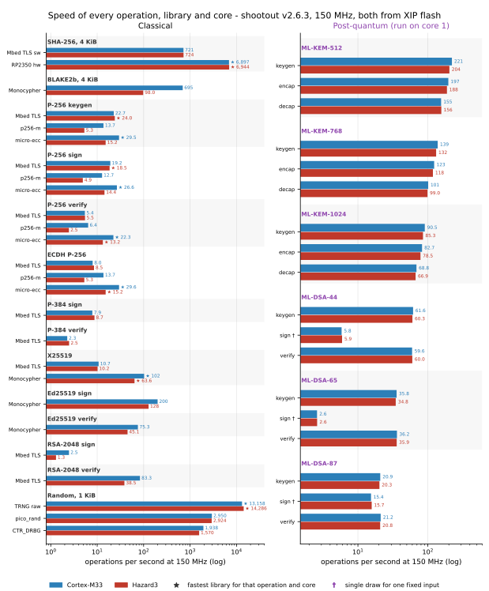

Time per operation, operations per second, and the ratio (Hazard3 time / M33
time; above 1 means the M33 is faster). ★ marks the fastest library for that
operation on that core.

| Operation | Library | M33 | M33 ops/s | Hazard3 | Hazard3 ops/s | ratio |
|---|---|---|---|---|---|---|
| Hash 4 KiB | SHA-256 Mbed TLS sw | 1.39 ms | 721.0 | 1.38 ms | 723.6 | 1.00× |
| Hash 4 KiB | SHA-256 RP2350 hw | ★ 145 µs | 6,896.6 | ★ 144 µs | 6,944.4 | 0.99× |
| Hash 4 KiB | BLAKE2b Monocypher | 1.44 ms | 695.4 | 10.20 ms | 98.0 | 7.10× |
| P-256 key generation | Mbed TLS | 43.98 ms | 22.7 | ★ 41.75 ms | 24.0 | 0.95× |
| P-256 key generation | p256-m | 73.25 ms | 13.7 | 189.16 ms | 5.3 | 2.58× |
| P-256 key generation | micro-ecc | ★ 33.85 ms | 29.5 | 65.77 ms | 15.2 | 1.94× |
| ECDSA P-256 sign | Mbed TLS | 52.13 ms | 19.2 | ★ 54.05 ms | 18.5 | 1.04× |
| ECDSA P-256 sign | p256-m | 78.47 ms | 12.7 | 203.90 ms | 4.9 | 2.60× |
| ECDSA P-256 sign | micro-ecc | ★ 37.63 ms | 26.6 | 69.61 ms | 14.4 | 1.85× |
| ECDSA P-256 verify | Mbed TLS | 184.20 ms | 5.4 | 182.97 ms | 5.5 | 0.99× |
| ECDSA P-256 verify | p256-m | 156.50 ms | 6.4 | 406.68 ms | 2.5 | 2.60× |
| ECDSA P-256 verify | micro-ecc | ★ 44.77 ms | 22.3 | ★ 75.59 ms | 13.2 | 1.69× |
| ECDH P-256 | Mbed TLS | 125.17 ms | 8.0 | 117.07 ms | 8.5 | 0.94× |
| ECDH P-256 | p256-m | 73.23 ms | 13.7 | 189.21 ms | 5.3 | 2.58× |
| ECDH P-256 | micro-ecc | ★ 33.79 ms | 29.6 | ★ 65.72 ms | 15.2 | 1.94× |
| ECDSA P-384 sign | Mbed TLS | 127.26 ms | 7.9 | 114.46 ms | 8.7 | 0.90× |
| ECDSA P-384 verify | Mbed TLS | 441.42 ms | 2.3 | 402.59 ms | 2.5 | 0.91× |
| X25519 | Mbed TLS | 93.17 ms | 10.7 | 98.22 ms | 10.2 | 1.05× |
| X25519 | Monocypher | ★ 9.76 ms | 102.4 | ★ 15.72 ms | 63.6 | 1.61× |
| Ed25519 sign | Monocypher | 5.00 ms | 200.0 | 7.82 ms | 128.0 | 1.56× |
| Ed25519 verify | Monocypher | 13.29 ms | 75.3 | 22.20 ms | 45.1 | 1.67× |
| ML-KEM-512 keygen | mlkem-native | 4.52 ms | 221.2 | 4.91 ms | 203.7 | 1.09× |
| ML-KEM-512 encap | mlkem-native | 5.08 ms | 196.7 | 5.32 ms | 188.0 | 1.05× |
| ML-KEM-512 decap | mlkem-native | 6.45 ms | 155.0 | 6.41 ms | 156.1 | 0.99× |
| ML-KEM-768 keygen | mlkem-native | 7.22 ms | 138.5 | 7.60 ms | 131.6 | 1.05× |
| ML-KEM-768 encap | mlkem-native | 8.11 ms | 123.4 | 8.45 ms | 118.3 | 1.04× |
| ML-KEM-768 decap | mlkem-native | 9.87 ms | 101.3 | 10.10 ms | 99.0 | 1.02× |
| ML-KEM-1024 keygen | mlkem-native | 11.04 ms | 90.5 | 11.72 ms | 85.3 | 1.06× |
| ML-KEM-1024 encap | mlkem-native | 12.10 ms | 82.7 | 12.74 ms | 78.5 | 1.05× |
| ML-KEM-1024 decap | mlkem-native | 14.53 ms | 68.8 | 14.96 ms | 66.9 | 1.03× |
| ML-DSA-44 keygen | mldsa-native | 16.24 ms | 61.6 | 16.59 ms | 60.3 | 1.02× |
| ML-DSA-44 sign | mldsa-native | 171.18 ms | 5.8 | 168.60 ms | 5.9 | 0.98× |
| ML-DSA-44 verify | mldsa-native | 16.77 ms | 59.6 | 16.66 ms | 60.0 | 0.99× |
| ML-DSA-65 keygen | mldsa-native | 27.95 ms | 35.8 | 28.77 ms | 34.8 | 1.03× |
| ML-DSA-65 sign | mldsa-native | 384.78 ms | 2.6 | 383.50 ms | 2.6 | 1.00× |
| ML-DSA-65 verify | mldsa-native | 27.64 ms | 36.2 | 27.86 ms | 35.9 | 1.01× |
| ML-DSA-87 keygen | mldsa-native | 47.91 ms | 20.9 | 49.22 ms | 20.3 | 1.03× |
| ML-DSA-87 sign | mldsa-native | 64.92 ms | 15.4 | 63.49 ms | 15.7 | 0.98× |
| ML-DSA-87 verify | mldsa-native | 47.23 ms | 21.2 | 48.05 ms | 20.8 | 1.02× |
| Random bytes (1 KiB) | TRNG raw (on-chip) | ★ 76 µs | 13,157.9 | ★ 70 µs | 14,285.7 | 0.92× |
| Random bytes (1 KiB) | pico_rand PRNG | 339 µs | 2,949.9 | 342 µs | 2,924.0 | 1.01× |
| Random bytes (1 KiB) | Mbed TLS CTR_DRBG | 516 µs | 1,938.0 | 637 µs | 1,569.9 | 1.23× |
| RSA-2048 sign | Mbed TLS | 404.87 ms | 2.5 | 770.35 ms | 1.3 | 1.90× |
| RSA-2048 verify | Mbed TLS | 12.00 ms | 83.3 | 25.95 ms | 38.5 | 2.16× |

**Per-core recommendations at 150 MHz:**

| Need | Cortex-M33 | Hazard3 |
|---|---|---|
| P-256 keygen / sign | micro-ecc (33.9 / 37.6 ms) | Mbed TLS (41.7 / 54.1 ms) |
| P-256 verify / ECDH | micro-ecc (44.8 / 33.8 ms) | micro-ecc (75.6 / 65.7 ms) |
| Key exchange | Monocypher X25519 (9.8 ms) | Monocypher X25519 (15.7 ms) |
| Signatures, classical | Monocypher Ed25519 (5.0 ms sign) | Monocypher Ed25519 (7.8 ms sign) |
| Hashing | SHA-256 hardware (145 µs per 4 KiB) | SHA-256 hardware (144 µs per 4 KiB); avoid BLAKE2b from flash (10.2 ms) |
| Random bytes | TRNG raw (76 µs per KiB) | TRNG raw (70 µs per KiB) |
| Post-quantum KEM | ML-KEM-768: 7.2 / 8.1 / 9.9 ms (keygen / encaps / decaps) | ML-KEM-768: 7.6 / 8.5 / 10.1 ms |
| Post-quantum signature verify | ML-DSA-65: 27.6 ms | ML-DSA-65: 27.9 ms |

p256-m is the slowest P-256 option on both cores; on Hazard3 it is 2.6× slower
than on the M33.

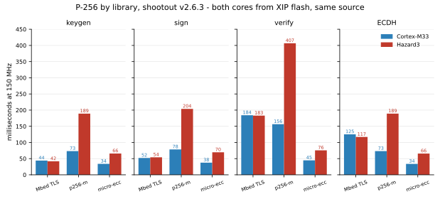
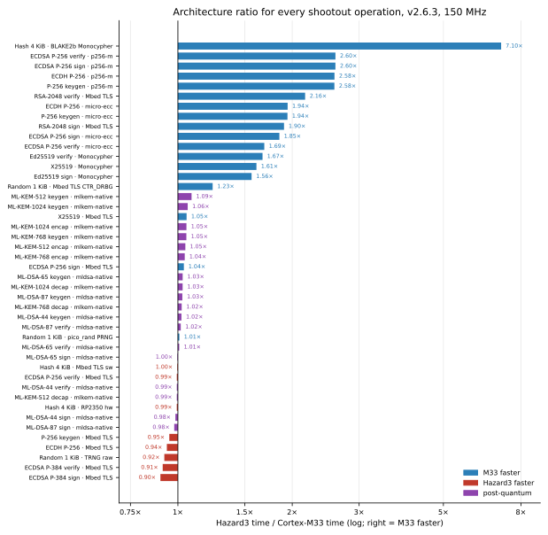

---

## 4. Overclocking at 1.60 V

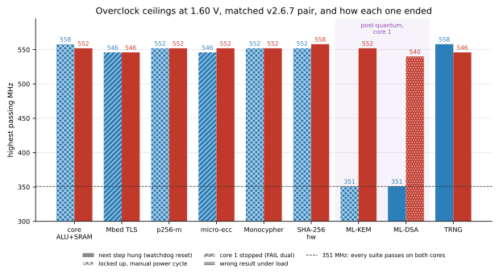

### 4.1 Ceilings (highest passing MHz) and failure modes

| Suite | M33 v2.6.5 | M33 v2.6.7 | Hazard3 v2.6.5 | Hazard3 v2.6.7 | v2.6.7 failure: M33 / Hazard3 |
|---|---|---|---|---|---|
| core (ALU + SRAM) | 564 | **558** | 564 | **552** | lockup at 564 / hang at 558 |
| Mbed TLS | 558 | **546** | 558 | **546** | core 1 stopped at 552 / hang at 552 |
| p256-m | 564 | **552** | 558 | **552** | lockup at 558 / hang at 558 |
| micro-ecc | 564 | **546** | 558 | **552** | core 1 stopped at 552 / hang at 558 |
| Monocypher | 558 | **552** | 558 | **552** | lockup at 558 / hang at 558 |
| SHA-256 hardware | 564 | **552** | 564 | **558** | lockup at 558 / hang at 564 |
| ML-KEM (core 1) | 552 | **351** | 460 | **552** | lockup at 400 / hang at 558 |
| ML-DSA (core 1) | 552 | **351** | 460 | **540** | hang at 400 / **wrong result at 546** |
| TRNG | 564 | **558** | 564 | **546** | hang at 564 / hang at 552 |

- **Lockup:** the next boot reported `power-on / normal` rather than `WATCHDOG`,
  meaning the watchdog did not recover the chip and it needed a manual power cycle.
- **Core 1 stopped:** v2.6.7 reported `FAIL dual (core1_done=0 core1_ops=0)`.
- **Hazard3 reset causes:** the cleaned Hazard3 log does not keep them, so its
  stops are listed as hangs.
- **Two runs of v2.6.5:** Hazard3 v2.6.5 values come from the first run's journal.
  The second run found ML-DSA at 500 MHz and p256-m hanging at 200 MHz (an anomaly).
- **Common safe clock:** 351 MHz is the highest step where every suite passed
  on both cores in v2.6.7. In v2.6.5 it was 460 MHz.

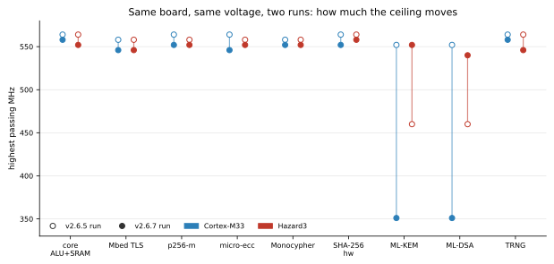

**Run to run.** Every core-0 suite came in one to three ladder steps lower
(6–18 MHz) in the second run. The post-quantum suites swapped places: the M33
fell from 552 to 351 MHz while Hazard3 rose from 460 to 552 MHz. The 40–50 MHz
Arm lead seen in an earlier v2.3.1 run did not reproduce. **There is no evidence
that either architecture overclocks better.**

### 4.2 Flash-divider staircase

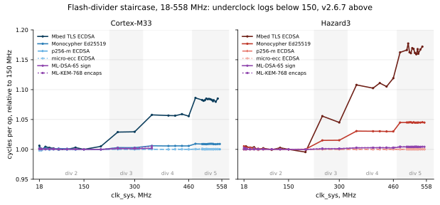

Cycles per operation relative to 150 MHz (v2.6.7):

| Divider | Clocks | Mbed TLS M33 | Mbed TLS Hazard3 | Monocypher M33 | Monocypher Hazard3 | all others |
|---|---|---|---|---|---|---|
| 2 | 18–200 | 1.00 | 1.00 | 1.00 | 1.00 | 1.00 |
| 3 | 250–300 | 1.03 | 1.06 | 1.00 | 1.02 | ≤1.00 |
| 4 | 351–460 | 1.06 | 1.11–1.12 | 1.01 | 1.03 | ≤1.01 |
| 5 | 480–558 | 1.08–1.09 | 1.16–1.17 | 1.01 | 1.05 | ≤1.01 |

Below 200 MHz the divider stays at its floor of 2, so a flash miss costs the same
number of core cycles at 18 MHz as at 150 MHz. The two post-quantum libraries,
micro-ecc, p256-m and the ALU loop hit the XIP cache 99.9% of the time and are
flash-insensitive.

### 4.3 Speedup at each suite's ceiling

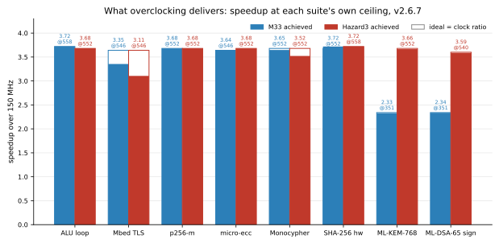

| Suite | M33 speedup / ideal | Hazard3 speedup / ideal |
|---|---|---|
| ALU loop | 3.72× / 3.72× @558 MHz (100%) | 3.68× / 3.68× @552 MHz (100%) |
| Mbed TLS | 3.35× / 3.64× @546 MHz (92%) | 3.11× / 3.64× @546 MHz (85%) |
| p256-m | 3.68× / 3.68× @552 MHz (100%) | 3.68× / 3.68× @552 MHz (100%) |
| micro-ecc | 3.64× / 3.64× @546 MHz (100%) | 3.68× / 3.68× @552 MHz (100%) |
| Monocypher | 3.65× / 3.68× @552 MHz (99%) | 3.52× / 3.68× @552 MHz (96%) |
| SHA-256 hw | 3.72× / 3.68× @552 MHz (101%) | 3.72× / 3.72× @558 MHz (100%) |
| ML-KEM-768 | 2.33× / 2.34× @351 MHz (99%) | 3.66× / 3.68× @552 MHz (100%) |
| ML-DSA-65 sign | 2.34× / 2.34× @351 MHz (100%) | 3.59× / 3.60× @540 MHz (100%) |

### 4.4 Throughput at 351 MHz (the common safe clock, one core)

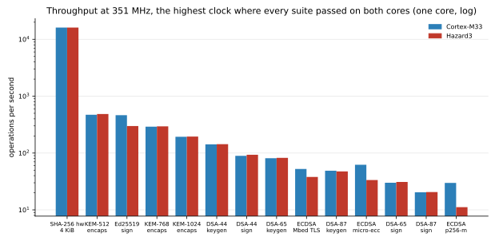

| Operation | M33 ops/s | Hazard3 ops/s |
|---|---|---|
| SHA-256 hw 4 KiB | 16,130.5 | 16,130.5 |
| KEM-512 encaps | 471.9 | 485.9 |
| Ed25519 sign | 463.2 | 298.6 |
| KEM-768 encaps | 291.0 | 294.6 |
| KEM-1024 encaps | 193.3 | 195.0 |
| DSA-44 keygen | 142.2 | 143.3 |
| DSA-44 sign | 89.4 | 93.2 |
| DSA-65 keygen | 81.2 | 82.4 |
| ECDSA Mbed TLS | 52.5 | 38.0 |
| DSA-87 keygen | 48.9 | 47.5 |
| ECDSA micro-ecc | 62.2 | 33.5 |
| DSA-65 sign | 30.0 | 31.0 |
| DSA-87 sign | 20.4 | 20.6 |
| ECDSA p256-m | 29.8 | 11.2 |

At 558 MHz the SHA-256 accelerator hashes 4 KiB in about 39 µs, roughly
100 MiB/s. TRNG raw output reaches about 51 MB/s. Its cost is about 2.7–2.9k
cycles per 256 B at every clock, so the TRNG runs from clk_sys.

---

## 5. Architecture and compiler

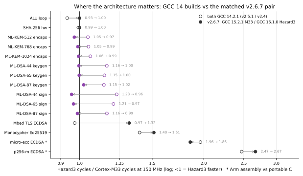

Cycles per operation at 150 MHz (sweep firmware, XIP flash):

| Operation | M33 GCC 14 | Hazard3 GCC 14 | ratio GCC 14 | M33 v2.6.7 | Hazard3 v2.6.7 | ratio v2.6.7 | Δ M33 | Δ Hazard3 |
|---|---|---|---|---|---|---|---|---|
| ALU loop | 750k | 700k | 0.93× | 750k | 750k | 1.00× | +0.0% | +7.1% |
| SHA-256 hw | 21.75k | 21.60k | 0.99× | 21.75k | 21.75k | 1.00× | +0.0% | +0.7% |
| ML-KEM-512 encaps | 743k | 778k | 1.05× | 743k | 722k | 0.97× | +0.1% | -7.2% |
| ML-KEM-768 encaps | 1,204k | 1,266k | 1.05× | 1,200k | 1,188k | 0.99× | -0.4% | -6.1% |
| ML-KEM-1024 encaps | 1,805k | 1,917k | 1.06× | 1,808k | 1,797k | 0.99× | +0.2% | -6.2% |
| ML-DSA-44 keygen | 2,455k | 2,859k | 1.16× | 2,457k | 2,448k | 1.00× | +0.1% | -14.4% |
| ML-DSA-65 keygen | 4,212k | 4,837k | 1.15× | 4,269k | 4,260k | 1.00× | +1.4% | -11.9% |
| ML-DSA-87 keygen | 7,179k | 8,222k | 1.15× | 7,172k | 7,338k | 1.02× | -0.1% | -10.8% |
| ML-DSA-44 sign | 3,918k | 4,821k | 1.23× | 3,916k | 3,746k | 0.96× | -0.1% | -22.3% |
| ML-DSA-65 sign | 11,721k | 14,162k | 1.21× | 11,670k | 11,280k | 0.97× | -0.4% | -20.3% |
| ML-DSA-87 sign | 17,351k | 20,211k | 1.16× | 17,181k | 16,976k | 0.99× | -1.0% | -16.0% |
| Mbed TLS ECDSA | 7,415k | 7,215k | 0.97× | 6,321k | 8,342k | 1.32× | -14.8% | +15.6% |
| Monocypher Ed25519 | 811k | 1,134k | 1.40× | 753k | 1,141k | 1.51× | -7.1% | +0.6% |
| micro-ecc ECDSA * | 5,517k | 10,833k | 1.96× | 5,642k | 10,467k | 1.86× | +2.3% | -3.4% |
| p256-m ECDSA * | 12,168k | 30,084k | 2.47× | 11,771k | 31,420k | 2.67× | -3.3% | +4.4% |
| TRNG 256 B | 2.85k | — | — | 2.85k | 2.70k | 0.95× | +0.0% | — |

- **Ratio:** Hazard3 cycles divided by M33 cycles; below 1 means Hazard3 is faster.
- **Δ columns:** change in cycles from the GCC 14 build to v2.6.7, per core.
- **Starred rows (\*):** these compare Arm assembly with portable C, not the
  architectures.
- **Builds:** GCC 14 means v2.5.1 on the M33 and v2.4.0 on Hazard3; v2.6.7 means
  GCC 15.2.1 on the M33 and GCC 16.1.0 on Hazard3.

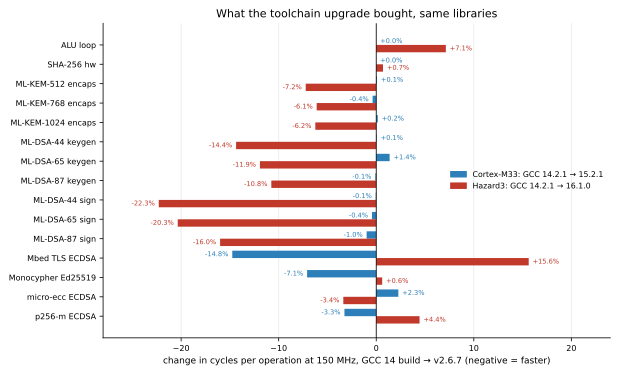

What the table shows:

- **Post-quantum:** the M33's 15–23% ML-DSA lead with GCC 14 was code generation.
  GCC 16.1 made Hazard3 ML-DSA 11–22% cheaper, and it now signs 1–4% faster than
  the M33.
- **Mbed TLS moved the other way:** 16% more expensive on Hazard3, 15% cheaper on
  the M33. It went from a slight Hazard3 lead (0.97×) to a 1.32× M33 lead. In the
  v2.6.3 shootout binary the ratio is 1.04×, so Mbed TLS is dominated by build and
  layout effects (±25%).
- **The ALU loop** costs exactly 750.00k cycles on both cores in v2.6.x. Hazard3
  paid 700k with GCC 14.
- **Real ISA gaps remain** for integer-heavy classical code: Monocypher 1.51×,
  RSA-2048 1.9–2.2×.

---

## 6. Dual core

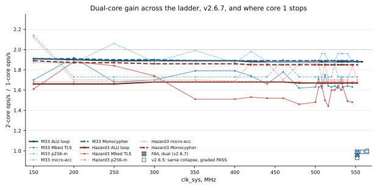

| Suite | M33 gain (median, range) | Hazard3 gain (median, range) |
|---|---|---|
| ALU loop | 1.88× (1.88–1.91) | 1.67× (1.66–1.68) |
| Monocypher | 1.89× (1.89–1.91) | 1.85× (1.85–1.89) |
| micro-ecc | 1.88× (1.87–2.06) | 1.70× (1.69–2.12) |
| p256-m | 1.73× (1.73–2.14) | 1.68× (1.67–1.68) |
| Mbed TLS | 1.68× (1.62–1.92) | 1.60× (1.44–1.88) |

- **Scaling:** the M33 scales better on the register-only loop (1.88–1.91× against
  1.66–1.68×).
- **Precision:** slow ECC suites alternate between fixed values, and values above
  2.0 are timing-window artefacts, so read them as ±0.15.
- **Single-core only:** SHA-256 (one engine), ML-KEM (48 KiB stack on core 1),
  ML-DSA and TRNG have no dual-core figure.
- **Core-1 dropout:** in v2.6.5, core 1 silently stopped doing work at 552–564 MHz
  on the M33. Gain fell to 0.93–1.00× (at 564 MHz the 2-core cost equalled the
  1-core cost exactly), yet the steps were graded PASS. v2.6.7 detects this and
  reports `FAIL dual` at 552 MHz for Mbed TLS and micro-ecc. Hazard3 never showed it.

---

## 7. ML-DSA signing depends on the input

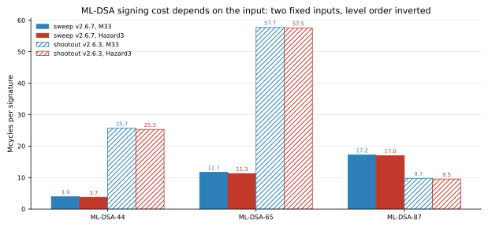

| Mcycles per signature | ML-DSA-44 | ML-DSA-65 | ML-DSA-87 |
|---|---|---|---|
| sweep v2.6.7, M33 | 3.92 | 11.67 | 17.18 |
| sweep v2.6.7, Hazard3 | 3.75 | 11.28 | 16.98 |
| shootout v2.6.3, M33 | 25.68 | 57.72 | 9.74 |
| shootout v2.6.3, Hazard3 | 25.29 | 57.53 | 9.52 |

Signing retries after each rejection, and each benchmark uses one fixed key and
message per level, so every figure is a single draw:

- **Input effect:** the shootout input costs 6.6× the sweep input at level 44 and
  4.9× at level 65, and makes level 87 the cheapest of the three.
- **Key generation** has no retries and agrees between the two builds within 2%.
- **Same input, both cores:** within 4% at every level.

---

## 8. Underclocking at 1.05 V (GCC 14 builds)

Both cores passed every suite at every step from 18 to 150 MHz. Cycle cost is
flat, so latency scales with 1/clock:

| Operation | M33 @18 MHz | Hazard3 @18 MHz | M33 @150 MHz | Hazard3 @150 MHz |
|---|---|---|---|---|
| Mbed TLS ECDSA sign | 414.5 ms | 401.0 ms | 49.44 ms | 48.10 ms |
| micro-ecc ECDSA sign | 305.9 ms | 601.7 ms | 36.78 ms | 72.22 ms |
| p256-m ECDSA sign | 676.0 ms | 1671.3 ms | 81.12 ms | 200.56 ms |
| Monocypher Ed25519 sign | 45.1 ms | 63.3 ms | 5.41 ms | 7.56 ms |
| ML-KEM-768 encaps | 67.0 ms | 70.5 ms | 8.03 ms | 8.44 ms |
| ML-DSA-44 sign | 218.0 ms | 268.1 ms | 26.12 ms | 32.14 ms |
| ML-DSA-65 sign | 651.5 ms | 786.8 ms | 78.14 ms | 94.41 ms |

Even at the 18 MHz PLL floor, a micro-ecc P-256 signature on the M33 takes about
0.3 s and an ML-KEM-768 encapsulation 67 ms. The minimum stable voltage for a
given clock was not measured.

---

## 9. Key and signature sizes (bytes)

| Scheme | public key | secret key | signature / ciphertext |
|---|---|---|---|
| ECDSA P-256 | 64 | 32 | 64 |
| Ed25519 | 32 | 64 | 64 |
| ML-KEM-512 | 800 | 1,632 | 768 |
| ML-KEM-768 | 1,184 | 2,400 | 1,088 |
| ML-KEM-1024 | 1,568 | 3,168 | 1,568 |
| ML-DSA-44 | 1,312 | 2,560 | 2,420 |
| ML-DSA-65 | 1,952 | 4,032 | 3,309 |
| ML-DSA-87 | 2,592 | 4,896 | 4,627 |

---

## 10. Practical guidance

- **Choosing a core:** for post-quantum work either core is fine. For classical
  ECC, RSA or Ed25519 prefer the M33, or on Hazard3 pick the library carefully
  (Mbed TLS for P-256 sign, micro-ecc for verify).
- **Choosing a library:** micro-ecc for P-256 (M33 especially), Monocypher for
  X25519/Ed25519, and the hardware for SHA-256 and randomness. Avoid p256-m on Hazard3.
- **Clock:** at the stock 1.10 V, stay at or below 150 MHz; that is the only
  qualified configuration. The 1.60 V results are beyond the datasheet's 1.30 V
  limit. If you overclock anyway, treat 351 MHz as the highest step observed
  clean on both cores, not as a qualified limit, and keep the watchdog plus an
  external reset path: the watchdog alone did not always recover the chip.
- **Check results when overclocking:** a wrong answer (Hazard3 ML-DSA-87 at
  546 MHz) and a silently idle core 1 both occurred without a hang. Validate
  known-answer output and core-1 progress at run time.
- **Flash:** at high clocks, Mbed TLS benefits most from running key code from
  SRAM.

---

## 11. Firmware issues found during this analysis

| Found in | Issue | Status |
|---|---|---|
| v2.6.5 sweep | Dual-core PASS did not check that core 1 did any work; gain ≈1.00× was graded PASS | **Fixed in v2.6.7** (`FAIL dual` when core 1 does nothing or gain ≤1.05×) |
| v2.6.5 sweep | Serial capture lost whole suite tables after each watchdog reset | **Fixed in v2.6.7** (acknowledgement after a watchdog reset) |
| v2.5.1 shootout | Hazard3 ran from SRAM, M33 from flash, which confounded the comparison | **Fixed in v2.6.3** (both XIP flash, same source) |
| v2.6.5 Hazard3 | Built from a dirty tree | **Fixed in v2.6.7** (clean 5c3273beb52e on both cores) |
| all | Watchdog does not always recover the chip at the top of the ladder | Open: needs an external reset |
| all | TRNG timings quantised to the 1 µs timer at high clocks | Open |
| all | Dual-core timing window too short for slow ECC (gains alternate between fixed values, some above 2.0) | Open |

---

## 12. Caveats

- **Samples:** one board, two overclock runs per core. Ceilings are observations
  and moved by up to about 200 MHz between runs.
- **No telemetry:** there were no thermal or supply readings. VSYS reads ADC full
  scale (9.897 V) and the die temperature sensor is unusable on this board.
- **Different builds:** the sweep (5c3273beb52e) and shootout (1edd0410f83b) are
  different binaries. GCC 14 baselines come from older firmware (v2.5.1 / v2.4.0).
  Compiler deltas are build-to-build changes, not a controlled experiment.
- **Flash layout:** Mbed TLS moves by up to 25% with flash layout.
- **ML-DSA configuration:** reduced-RAM build, with the pairwise consistency
  self-tests disabled in both post-quantum libraries.
- **ML-DSA signing** figures are single draws per level and input.
- **Side channels** were not measured.

---

## 13. Files

| File | Content |
|---|---|
| `rp2350-crypto-v2.6.7-report.html` | Final illustrated report (self-contained, 12 charts) |
| `RESULTS-v2.6.7.md` | This summary |
| `svg/*.svg` | The 12 charts referenced above |
| `raw/results_overclock_*_arm-src_v2_6_5__2_clean.txt` | v2.6.7 M33 sweep (primary) |
| `raw/results_overclock_*_riscv-src_v2_6_5__3_clean.txt` | v2.6.7 Hazard3 sweep (primary) |
| `raw/results_overclock_*_v2_6_5.txt`, `*__2.txt` | v2.6.5 sweeps (second ceiling sample, reset causes) |
| `raw/results_underclock_*` | v2.5.1 / v2.4.0 sweeps at 1.05 V (GCC 14 baseline) |
| `raw/results_pico-crypto-*_v2_6_5_shootout.txt` | v2.6.3 shootouts (primary library comparison) |
